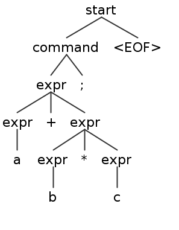
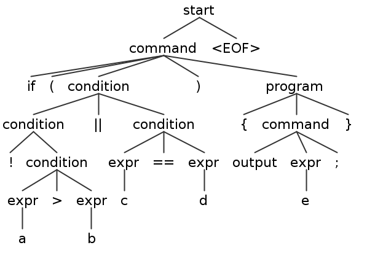
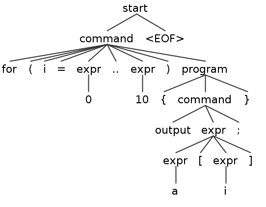

<!---
title: "Compiler Mandatory"
author: "Martin Mårtenssen s.195469 & Daniel Styrbæk-Petersen s.143861"
date: October 9, 2020
geometry: margin=2cm
output: pdf_document
-->

## Task 1

### Grammar
We added the following constants to our grammar file
```java
PLUS  : '+'   ;
MINUS : '-'   ;
MULT  : '*'   ;
DIV   : '/'   ;
```

And we extended the expr but adding the following expressions:

```java
expr
  : e1=expr op=(MULT | DIV) e2=expr       #multiplication
  | e1=expr op=(PLUS | MINUS) e2=expr     #addition
  ;
```

The reason **multiplication** is before addition is because we want our program to check for possible miltiplications on the line, before it checks for additions. This is important because it will help us, going down our parse tree in the right order.

So if eg. we wrote:

```
a+b*c;
```

Then we would get the following parse tree



Where the calculation would return the value of $a + (b \cdot c)$ even though $a + b$ is written before $b \cdot c$

### Java implementation
To implement the changes made to the grammar, we altered the visitAddition() and visitMultiplication() functions implemented from the **Interface** `implVisit.java`.

As seen in the changes to the grammar file, we made it so each operand can be identified by the ***op*** variable. This made implementing
subtraction and division, relatively simple by adding and if-statement to the methods in java, as seen in the alteration of the visitAddition method below:

```java
public Double visitAddition(implParser.AdditionContext ctx) {
if(ctx.op.getText() == "+")
  return visit(ctx.e1)+visit(ctx.e2);
else
  return visit(ctx.e1)-visit(ctx.e2);
}
```
  
## Task 2 

### Conditional branching
  
#### Grammar
We added the following constant to the grammar file

```java
AND   : '&&'   ;
OR    : '||'   ;
EQ    : '=='   ;
NEQ   : '!='   ;
LEQ   : '<='   ;
GEQ   : '>='   ;
GT    : '>'    ;
LT    : '<'    ;
NOT   : '!'    ;
```

Then we extended the condition grammar to the following:

```java
condition 
    : NOT c=condition                           # notCondition
    | c1=condition op=(OR|AND) c2=condition     # logicalCondition
    | e1=expr op=(EQ | NEQ) e2=expr             # equalityCondition
    | e1=expr op=(LEQ | GEQ | LT | GT ) e2=expr # relationalCondition
    ; 
```

Worth noting in the implementation of the *OR* and *AND* conditions, we made use of recursive grammar. So c1 and c2 could theoritcally include other conditions.

If we write the following code:

```
if(!a>b||c==d){
    output e;
}
```

Then we would get the following parse tree.



#### Implementation
We extended the visitor class in the main.java file to accomodate these changes, the overall implementation strategy was similiar to that of task 1. Because of the ability to identify the operand during the visit. The implementation of our logical condition can be seen below

```java
public Double visitLogicalCondition(implParser.LogicalConditionContext ctx){
    if(ctx.op.getText().equals("&&")){
        if (visit(ctx.c1) == 1.0 && visit(ctx.c2) == 1.0)
            return 1.0;
        else
            return 0.0;
    } else if(ctx.op.getText().equals("||")){
        if (visit(ctx.c1) == 1.0 || visit(ctx.c2) == 1.0)
            return 1.0;
        else
            return 0.0;
    } else
        return null;
}
```

We see in this implementation, that after we have identified whether we are dealing with an *AND* or a *OR* statement, we visit the conditions c1 and c2, to see what values they return. Important to note, that c1 and c2 themselves are condition and could theoretacilly be *AND* or *OR* statements themselves. Then based on the logical statement we either return 1.0 or 0.0.
 
### For-loops

#### Grammar
To implement this simplified for-loop, we expand the command grammar, to include the following line
  
```java
FOR '(' x=ID '=' e1=expr '..' e2=expr ')' p=program		#forloop
```
We first make an assignment, followed by two expression seperated by the '..' indicator. 

So if we consider the following code:

```
for(i=0..10){
    output a[i];
}
```

Then we would get the following parse tree.


  
#### Implementation
In the implementation of the simplified for-loop we altered the visitor class in the main.java file, and extended it with a visitForLoop method, that can be seen below:
  
```java
public Double visitForloop(implParser.ForloopContext ctx){
    String variable = ctx.x.getText();
    env.setVariable(variable,visit(ctx.e1));
    Double end=visit(ctx.e2);
    Double value = env.getVariable(variable)-1;
    while(value < end){
        env.setVariable(variable,++value);
        visit(ctx.p);
        value = env.getVariable(variable);
    }
    return null;
  }
```

The method starts by getting the name of the variable used in the for-loop, by visiting the x. This string is then assigned to the
value of the expression e1. We then use a simple incrementing while-loop to iterate over the loop.
  
### Simplified Arrays
  
#### Grammar
To implement the array grammar, we needed to expressions. One for initialization of a complete array in the form of:

```java
a = { 0, 1, 2, 3, 4, 5 };
```

To accomplish this we added an array initializing part to the expr grammar:

```java
'{' e=expr (',' es+=expr)* '}'		#array
```

Now we need grammar that can handle individual assigenments of an array, aswell as reassignment of the indexed elements of an already initialized array. For this purpose, the following was added to expression:

```java
x=expr '[' e=expr ']'			#arrayIndex
```

So if we write the following code:

```java
a = { 0, 1, 2, 3, 4, 5 };
```

Then we would get the following parse tree.

![parse tree]

The strategy here is to take the previusly assigned variable from when the array was initialized, and combine it with the expression inside the square brackets. 

#### Implementation
The implementation of the visitArray() and visitArrayindex() methods can be seen below

  ```java
  public Double visitArray(implParser.ArrayContext ctx){
        env.setVariable(this.lastVariable+"[0]",visit(ctx.e));
        int i = 1;
        for(implParser.ExprContext e: ctx.es){
            env.setVariable(this.lastVariable+"["+i+"]",visit(e));
            i++;
        }
        return 0.0;

    }
	public Double visitArrayIndex(implParser.ArrayIndexContext ctx){
        int index = visit(ctx.e).intValue();
        return env.getVariable(ctx.x.getText()+"["+index+"]");
    }
   ```
   In the visitArray() method we take advantage of the setVariable function, to assign each instance of a variable to its corrosponding index like so:
   
   ```java
   a = {0,2,4,8,16} -> a[0] = 0, a[1] = 2 ... a[4] = 16
  ```
  And then when we visit the array index we simply return the value of the assigned variable.
  
  ### IF-statement
  
  #### Grammar
  
  #### Implementation
  
  #### Else-statement
  
  ## Task 3
  ### Grammar
  
  
  ## Task 4
  ### Grammar
